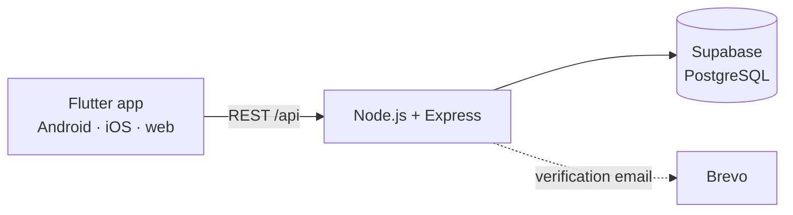

<h1 align="center">SplitEase</h1>

<p align="center"><b>Split group expenses without the awkward maths.</b></p>

<p align="center">
A mobile-first app for trips, housemates and team dinners: add an expense,<br>
split it equally or by custom amounts, and see who owes whom at a glance.
</p>

<p align="center">
  <a href="#how-it-works">How it works</a> ·
  <a href="#run-it-locally">Run locally</a> ·
  <a href="docs/SETUP.md">Full setup</a> ·
  <a href="docs/DEPLOY.md">Deploy</a>
</p>

<!-- Screenshots: add a row of 3–4 phone screens here (docs/assets/screens.png). -->

## Features

- **Groups:** create a group with a description, then add members by searching for real users.
- **Flexible splits:** split an expense equally, or set a custom amount for each person.
- **Balances and settle-up:** every group shows who owes whom, and a settlement clears the debt.
- **Friends:** send, accept or reject friend requests before adding people to groups.
- **Activity feed:** a running history of expenses and settlements across your groups.
- **Verified sign-up:** new accounts confirm their email, and sessions persist between launches.

## How it works



The Flutter app talks only to the Express API. The API owns the business rules (splits, balances, settlements) and stores everything in Supabase Postgres. Splits are stored per person, so equal and custom splits use the same balance logic.

## Run it locally

You need Node 20+, Flutter 3+ and a [Supabase](https://supabase.com) project. Run the two SQL files in `backend/src/db/migrations/` in the Supabase SQL editor, then:

```bash
# 1 · API on :5001
cd backend && cp .env.example .env    # add SUPABASE_URL, SUPABASE_SECRET_KEY, JWT_SECRET
npm install && npm run dev

# 2 · App
cd frontend && flutter pub get && flutter run
```

Email sending is optional: without `BREVO_API_KEY`, the verification link is printed in the API console. Every variable is explained in [docs/SETUP.md](docs/SETUP.md).

## Tech stack

| Layer | Tech |
|---|---|
| App | Flutter, Provider, shared_preferences |
| API | Node.js, Express |
| Data | Supabase (PostgreSQL), SQL migrations |
| Email | Brevo (optional) |
| CI / deploy | GitHub Actions (API checks and tests, `flutter analyze` and `flutter test`), Docker on Render |

<details>
<summary><b>API at a glance</b></summary>
<br>

| Area | Endpoints |
|---|---|
| Auth | `POST /api/auth/register` · `POST /api/auth/login` · `GET /api/auth/verify` · `POST /api/auth/resend-verification` |
| Groups | `GET/POST /api/groups` · `GET/PUT/PATCH/DELETE /api/groups/:id` · `POST /api/groups/:id/members` |
| Expenses | `GET/POST /api/groups/:groupId/expenses` · `PUT/PATCH/DELETE /api/groups/:groupId/expenses/:expenseId` |
| Balances | `GET /api/groups/:groupId/balances` · `POST /api/groups/:groupId/settlements` |
| Friends | `GET /api/friends` · `POST /api/friends/request` · `POST /api/friends/requests/:userId/accept` (or `reject`) |
</details>
